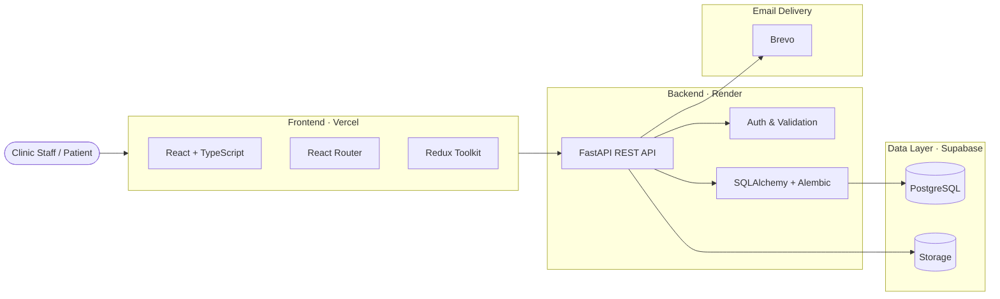

# Clinic CRM

[](#license)
[](#tech-stack)
[](#tech-stack)
[](#tech-stack)

Clinic CRM is a modern full-stack platform for managing clinic operations with a focus on patients, appointments, authentication, communication, and day-to-day administrative workflows. The system is designed to support both clinic staff and patients through a streamlined digital experience.

The project combines a React-based frontend with a FastAPI backend, PostgreSQL data storage, file handling, and transactional email delivery. It is structured as a scalable web application with clear separation between presentation, API, data access, and infrastructure concerns.

## 🚀 Features

- Patient and doctor profile management
- Appointment booking and clinic workflow support
- Authentication and role-based access control
- Email notifications for communication and onboarding flows
- File storage integration for clinic-related assets
- Modern admin-oriented UI built for daily operations

## Engineering Highlights

- Async backend architecture with FastAPI, SQLAlchemy, and asyncpg for efficient database access
- Strong typing on the frontend with TypeScript and validated request/response models on the backend
- Database evolution and schema management through Alembic migrations
- Containerized local development workflows with Docker Compose for backend services and dependencies
- Clear separation of concerns between UI, API, persistence, storage, and email delivery layers

## Screenshots

Interface screenshots will be added in a future update.

## 🏗️ Architecture



The application flow is straightforward: the frontend sends HTTP requests to the backend, the backend processes business logic and validation, and the data layer persists information in Supabase while email notifications are delivered through Brevo.

## 🛠️ Tech Stack

### Frontend

- React 19
- TypeScript
- Vite
- Redux Toolkit
- React Router
- React Hook Form
- Axios
- Tailwind CSS
- Sass
- React Hot Toast
- React Icons

### Backend

- Python 3.12
- FastAPI
- Uvicorn
- SQLAlchemy
- Alembic
- Pydantic and Pydantic Settings
- PostgreSQL with asyncpg
- PyJWT
- pwdlib / Argon2
- aiosmtplib
- Jinja2
- aioboto3
- Pillow

### Infrastructure and Services

- Vercel for frontend deployment
- Render for backend deployment
- Supabase for PostgreSQL and storage
- Brevo for transactional email
- Docker Compose for local development and deployment workflows

## 🚀 Quick Start / Setup

### Frontend

The frontend is a Vite + React + TypeScript application. For local development, install dependencies and start the dev server from the frontend folder.

```bash
cd frontend
npm install
npm run dev
```

Useful frontend commands from the current configuration:

```bash
npm run build
npm run lint
npm run preview
npm run deploy
```

For detailed frontend instructions, see [frontend/README.md](frontend/README.md).

### Backend

The backend is built with FastAPI and is intended to run locally with Docker Compose for development and production-like setups.

```bash
cd backend
cp .env.sample .env
docker compose -f docker-compose-dev.yml up --build
```

To create the initial admin account after the services are running:

```bash
docker compose -f docker-compose-dev.yml exec web python src/create_initial_admin.py --email admin@admin.com
```

For detailed backend setup, environment configuration, and available services, see [backend/README.md](backend/README.md).
For the monitoring setup, see [MONITORING.md](MONITORING.md).

## ☁️ Deployment

The application is designed for a modern cloud deployment flow:

- Frontend: Vercel for hosting the React application
- Backend: Render for the FastAPI service
- Database and storage: Supabase PostgreSQL and storage buckets
- Email delivery: Brevo for transactional notifications

Environment variables and service credentials should be configured in the respective deployment platforms rather than committed to the repository.

## 📂 Project Structure

The repository is organized into two main application layers:

- [frontend](frontend) for the user interface and client-side logic
- [backend](backend) for the API, business logic, database access, and services

## 📄 License

© 2026 Clinic CRM. All rights reserved.

This project is intended for portfolio, evaluation, and personal learning use only. The repository may be viewed and reviewed for demonstration purposes, but copying, redistribution, modification, or commercial reuse requires prior written permission from the author.
